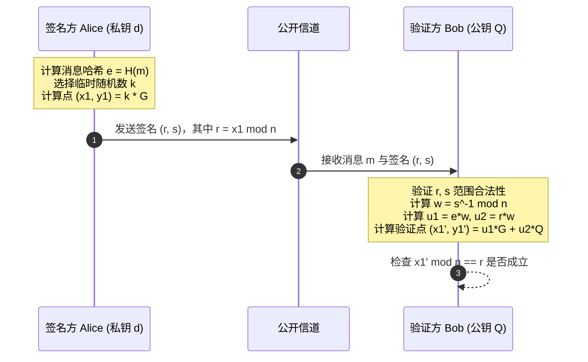

椭圆曲线密码学（Elliptic Curve Cryptography, ECC）是现代安全通信、TLS 握手以及区块链系统的核心安全基石。相较于传统的 RSA 算法，ECC 能够以极短的密钥长度（如 256 位 vs 3072 位）提供同等强度的安全保障。

本文将从代数数论的基础定义出发，形式化推导有限域椭圆曲线上的群运算规则，并解析 ECDSA 签名的数学原理。

## 1. 有限域上的 Weierstrass 方程

在特征不为 2 或 3 的有限域 $\mathbb{F}_p$（其中 $p$ 为大素数）上，标准短 Weierstrass 椭圆曲线定义为满足如下同余方程的点集 $(x, y) \in \mathbb{F}_p \times \mathbb{F}_p$，加上一个无穷远点 $\mathcal{O}$：

$$
E(\mathbb{F}_p): y^2 \equiv x^3 + ax + b \pmod p
$$

为了保证曲线光滑且无奇点（Singularity），其判别式 $\Delta$ 必须满足非零条件：

$$
\Delta = -16(4a^3 + 27b^2) \not\equiv 0 \pmod p
$$

## 2. 几何弦切法与群运算加法规则

椭圆曲线上的点构成一个阿贝尔群（Abelian Group）。给定曲线上的两点 $P(x_1, y_1)$ 与 $Q(x_2, y_2)$，点加运算 $R = P + Q = (x_3, y_3)$ 的坐标计算公式如下：

$$
\lambda = \begin{cases}
\frac{y_2 - y_1}{x_2 - x_1} \pmod p & \text{若 } P \neq Q \text{ (点加)} \\[10pt]
\frac{3x_1^2 + a}{2y_1} \pmod p & \text{若 } P = Q \text{ (倍点)}
\end{cases}
$$

由此得到合成点 $R$ 的坐标：

$$
x_3 \equiv \lambda^2 - x_1 - x_2 \pmod p
$$

$$
y_3 \equiv \lambda(x_1 - x_3) - y_1 \pmod p
$$



## 3. Python 参考实现与离散对数难解性

ECC 的安全性建立在**椭圆曲线离散对数问题（ECDLP）**的计算难解性之上：已知基点 $G$ 和公钥点 $Q = d \cdot G$，在多项式时间内求解私钥标量 $d$ 在计算上是不可行的。

```python
class EllipticCurvePoint:
    def __init__(self, x: int, y: int, a: int, b: int, p: int):
        self.x = x
        self.y = y
        self.a = a
        self.b = b
        self.p = p
        self.is_infinity = (x is None and y is None)

    def __add__(self, other: "EllipticCurvePoint") -> "EllipticCurvePoint":
        if self.is_infinity:
            return other
        if other.is_infinity:
            return self

        p, a = self.p, self.a
        if self.x == other.x and (self.y + other.y) % p == 0:
            return EllipticCurvePoint(None, None, a, self.b, p)

        if self.x != other.x:
            # 点加斜率
            inv = pow(other.x - self.x, -1, p)
            slope = ((other.y - self.y) * inv) % p
        else:
            # 倍点斜率
            inv = pow(2 * self.y, -1, p)
            slope = ((3 * self.x**2 + a) * inv) % p

        x3 = (slope**2 - self.x - other.x) % p
        y3 = (slope * (self.x - x3) - self.y) % p
        return EllipticCurvePoint(x3, y3, a, self.b, p)

    def scalar_mul(self, k: int) -> "EllipticCurvePoint":
        """双倍加算法 (Double-and-Add) 标量乘法"""
        result = EllipticCurvePoint(None, None, self.a, self.b, self.p)
        current = self
        while k > 0:
            if k & 1:
                result = result + current
            current = current + current
            k >>= 1
        return result
```

## 4. 关键脆弱点与 Nonce 重用陷阱

> 注意：在 ECDSA 签名过程中，若对不同消息签名使用了相同的随机数 $k$，攻击者可直接通过两个签名的代数差分恢复出私钥 $d$（如 Sony PS3 破解事件中的经典漏洞）。

现代系统通常采用 RFC 6979 确定性 Nonce 生成方案，从私钥和消息哈希的 HMAC 导出 $k$，彻底杜绝随机数熵源不足带来的致命风险。
