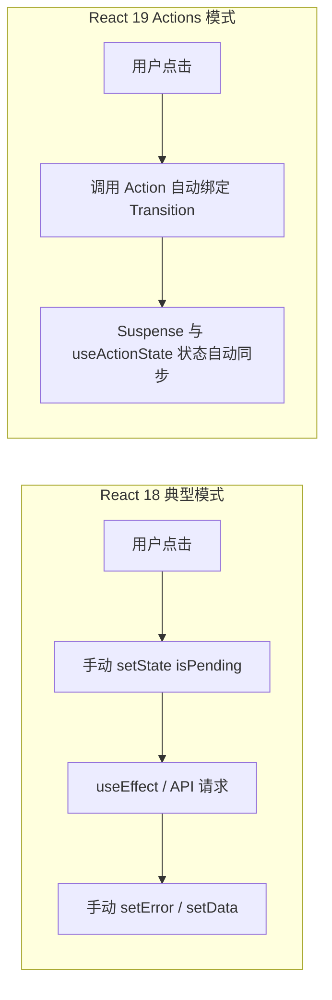

React 19 的发布标志着 React 团队长达数年“解耦声明式 UI 与命令式副作用”的探索走向成熟。从早期的类组件生命周期，到 Hook 时代的 `useEffect` 滥用，再到如今由 `use`、`useActionState` 和编译器全面接管的数据流范式，开发者的心智负担得到了根本性的舒缓。

本文将通过对比实际代码重构路径，深入解析 React 19 的核心特性与工程实践。

## 1. 原生解包利器：`use()` API 的条件调用

在 React 18 及之前版本中，Hooks 严格禁止出现在 `if` 条件分支、循环语句或嵌套函数内。React 19 引入的 `use()` 打破了这一机械限制，支持在条件分支中优雅地解包 Promise 或 Context。

```tsx
import { use, Suspense } from 'react';

interface UserProfileProps {
  userPromise: Promise<{ name: string; avatar: string; role: string }>;
  showDetails: boolean;
}

function UserCard({ userPromise, showDetails }: UserProfileProps) {
  // 在条件分支中直接调用 use() 解包异步数据
  if (!showDetails) {
    return <div className="text-stone-400">点击展开用户详情</div>;
  }

  const user = use(userPromise);

  return (
    <div className="p-4 rounded-xl border border-stone-200 dark:border-stone-800">
      <h3 className="font-serif text-lg font-medium">{user.name}</h3>
      <p className="text-sm text-stone-500">{user.role}</p>
    </div>
  );
}
```

## 2. 异步状态统一：Actions 与 `useActionState`

过去在处理异步表单提交时，我们往往需要手动维护 `isPending`、`error`、`data` 等多重状态并小心翼翼地包裹 `try-catch`。在 React 19 中，Actions 成为一等公民：

```tsx
import { useActionState } from 'react';

async function updateProfileName(prevState: { error?: string } | null, formData: FormData) {
  const newName = formData.get('name') as string;
  try {
    await fetch('/api/user/rename', {
      method: 'POST',
      body: JSON.stringify({ name: newName }),
    });
    return { success: true };
  } catch (err: unknown) {
    return { error: (err as Error).message };
  }
}

export function ProfileForm() {
  const [state, formAction, isPending] = useActionState(updateProfileName, null);

  return (
    <form action={formAction} className="space-y-3">
      <input
        name="name"
        type="text"
        placeholder="输入新昵称"
        className="w-full px-3 py-2 rounded-lg border bg-stone-50 dark:bg-stone-900"
        required
      />
      <button
        type="submit"
        disabled={isPending}
        className="px-4 py-2 text-sm rounded-lg bg-stone-800 text-stone-100 hover:bg-stone-700 disabled:opacity-50 transition-colors"
      >
        {isPending ? '保存中...' : '提交更新'}
      </button>
      {state?.error && <p className="text-xs text-red-500">{state.error}</p>}
    </form>
  );
}
```

## 3. 架构对比：React 18 vs React 19 数据流



## 4. 纸质设计系统中的轻量化原则

在构建本个人博客系统时，我们完全舍弃了沉重的全家桶状态管理库，仅通过 React 19 的原生数据流以及 Wouter 的微型路由核心即可实现全站的高性能渲染。这种“克制、聚焦于本质”的工程哲学，与纸质美学所追求的静谧感不谋而合。
